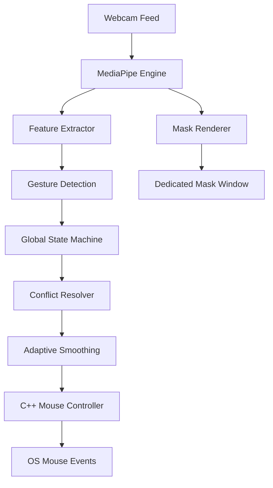

# VRMOUSE V2 System Documentation

VRMOUSE V2 is a production-grade virtual mouse system that uses advanced hand tracking, a strict gesture state machine, and adaptive smoothing to provide a precise and stable user experience.

## 🚀 System Architecture (V2)

The V2 architecture is highly modular, separating feature extraction, state logic, and rendering.

## 📁 Modular File Structure

### Core Logic & Processing
- **[main.py](file:///e:/VRMOUSE/python/main.py)**: Central orchestrator. Manages the camera loop, multi-window rendering, and coordinates between all V2 modules.
- **[gesture_engine.py](file:///e:/VRMOUSE/python/gesture_engine.py)**: The processing pipeline. Integrates the state machine and conflict resolver.
- **[feature_extractor.py](file:///e:/VRMOUSE/python/feature_extractor.py)**: **(New in V2)** Extracts physical hand metrics (joint angles, palm orientation, extension states) instead of raw coordinates.
- **[state_machine.py](file:///e:/VRMOUSE/python/state_machine.py)**: **(New in V2)** Manages the lifecycle (`IDLE`, `DETECTED`, `CONFIRMED`, `ACTIVE`, `RELEASED`, `COOLDOWN`) for every gesture.
- **[conflict_resolver.py](file:///e:/VRMOUSE/python/conflict_resolver.py)**: **(New in V2)** Resolves simultaneous gesture triggers based on priority (e.g., Drag > Click).
- **[smoothing_engine.py](file:///e:/VRMOUSE/python/smoothing_engine.py)**: **(New in V2)** Adaptive velocity-based smoother that eliminates jitter and provides precision mapping.

### OS Control & UI
- **[mouse_control.cpp](file:///e:/VRMOUSE/cpp/mouse_control.cpp)**: C++ backend for low-level mouse event simulation.
- **[mask_renderer.py](file:///e:/VRMOUSE/python/mask_renderer.py)**: **(New in V2)** Renders a dedicated black-and-white high-contrast hand mask window.

### AI & Data Pipeline
- **[data_collector.py](file:///e:/VRMOUSE/python/data_collector.py)**: Updated for V2 to collect 14-feature vectors into `gesture_data_v2.csv`.
- **[ai_trainer.py](file:///e:/VRMOUSE/python/ai_trainer.py)**: Updated to train Random Forest models on V2 feature sets.
- **[gesture_model.pkl](file:///e:/VRMOUSE/python/gesture_model.pkl)**: The exported ML model.

## 🛠️ Key Technical Improvements

### 1. Gesture Lifecycle
V2 uses a **Stable Confirmation** system. A gesture must be detected for 6 consecutive frames before it is "Confirmed" and then "Active", preventing accidental triggers.

### 2. Adaptive Smoothing
The smoother dynamically adjusts its response. Slow hand movements receive heavy smoothing for precision, while fast movements are tracked with low latency for speed.

### 3. Feature Engineering
By using **finger joint angles** and **palm orientation**, the system is much more robust to varying hand sizes and distance from the camera.

## ⚙️ Workflow

1. **Start System**: `python python/main.py`.
2. **Control**: Use `[T]` to toggle mouse control.
3. **Training**: 
   - Record data with `python python/data_collector.py` (select 1-6).
   - Train the model with `python python/ai_trainer.py` (press `[T]`).

---
*Generated by Antigravity AI*